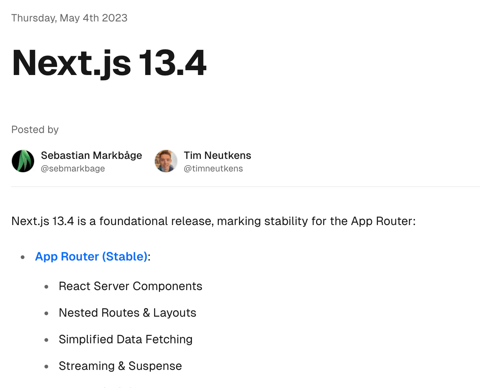

:::callout{type="note"}
This article serves as an example of a long article with many headers. It was written by and is copyright Josh W. Comeau; the original version is
located [here](https://www.joshwcomeau.com/react/css-in-rsc/).
:::

## Introduction

Around this time last year, Vercel announced the stable release of Next 13.4, becoming the first React framework to be built on top of _React Server Components_.



This is a big deal! RSC (React Server Components) gives us an official way to write _server-exclusive code_ in React. It opens a lot of interesting new doors.

But you can't make an omelette without cracking a few eggs. RSC is a fundamental change to how React works, and some of the libraries and tools we've been using have gotten scrambled. 😅

Concerningly, the most popular CSS-in-JS libraries like 💅 styled-components and Emotion aren't fully compatible with this new vision for React, and there hasn’t really been a clear path forward.

Over the past few months, I’ve been digging into this, building an understanding of the compatibility issues, and learning about what the options are. At this point, I feel like I have a pretty solid grasp on the whole situation. I’ve also discovered some pretty exciting developments that have been flying under the radar. ✨

If you use a CSS-in-JS library, my hope is that this blog post will help clear away a lot of confusion, and give you some practical options for what to do.

And if you _don’t_ use a CSS-in-JS library, this blog post should still help deepen your understanding of React Server Components. Many of the issues we’ll cover here aren't specific to CSS-in-JS!

<!-- prettier-ignore -->
:::callout{type="note" title='"Just use ___________"'}
When this discussion comes up online, one of the most common suggestions is to switch to a different CSS tool. After all, there are no shortage of options in the React ecosystem!

For many of us, though, this isn't a practical suggestion. I have more than 5,000 styled components across my blog and course platform. Migrating to an entirely different tool is much easier said than done.

And honestly, even if I _could_ snap my fingers and swap in a totally different library, I wouldn't want to. I really like the `styled` API!

Later in this blog post, we will discuss some alternative CSS libraries, but we’ll focus on options with similar APIs to styled-components.
:::

## Breaking down React Server Components

In order to understand the compatibility issues, we need to understand React Server Components. Before we can talk about that, though, we need to make sure that we understand _Server Side Rendering_ (SSR).

SSR is an umbrella term that comprises several different strategies and implementations, but the most typical version of it looks like this:

1. User visits our web app.
2. The request is received by Node.js, which runs React in a windowless server environment. It renders our application and produces a fully-formed HTML document containing all of the initial UI.
3. When this HTML document loads on the user’s device, React will re-render all of the same components, repeating the work done on the server. Instead of generating new HTML elements, however, it “adopts” the HTML elements that were generated by the server.[^fn1] This is known as hydration.

[^fn1]:
    Pedantic note: I'm using the term "HTML element" here, but the more
    correct term would be "DOM node". The server generates the HTML, and the browser
    renders it into a live representation known as the DOM.

React needs to run on the user’s device to handle interactivity. The HTML generated by the server is totally static; it won't include any event handlers we’ve written (eg. `onClick`), or capture any refs we’ve specified (with the `ref` attribute).

**OK, but why does it have to re-do all of the exact same work??** When React boots up on the user’s device, it’ll discover a bunch of pre-existing UI, but it won't have any _context_ about it, such as which component owns each HTML element. React needs to perform the exact same work in order to reconstruct the component tree, so that it can wire up the existing HTML correctly, attaching event handlers and refs to the correct elements. React needs to draw itself a map so that it can pick up where the server left off.

**There's one big limitation with this model.** All of the code we write will be executed on the server and the client. There's no way to create components that render exclusively on the server.

Let’s suppose we're building a full-stack web application, with data in a database. If you were coming from a language like PHP, you might expect to be able to do something like this:

```jsx {2}
function Home() {
  const data = db.query("SELECT * FROM SNEAKERS");
  return (
    <main>
      {data.map((item) => (
        <Sneaker key={item.id} item={item} />
      ))}
    </main>
  );
}
```

In theory, this code could work just fine on the server, but that exact _same code_ will be re-executed on the user’s device, which is a problem, since client-side React won’t have access to our database. There’s no way to tell React “Run this code only on the server, and re-use the resulting data on the client”.

Meta-frameworks built on top of React have come up with their own solutions. For example, in Next.js, we can do this:

```jsx {1-8}
export async function getServerSideProps() {
  const data = await db.query("SELECT * FROM SNEAKERS");
  return {
    props: {
      data,
    },
  };
}

function Home({ data }) {
  return (
    <main>
      {data.map((item) => (
        <Sneaker key={item.id} item={item} />
      ))}
    </main>
  );
}
```

The Next.js team said “Alright, so the exact same React code has to run on the server and client… but we can add some _extra_ code, outside of React, that only runs on the server!”.

When the Next.js server receives a request, it'll first invoke the `getServerSideProps` function, and whatever it returns will be fed in as props to the React code. The exact same _React_ code runs on the server and client, so there’s no problem. Pretty clever, right?

I'm honestly a pretty big fan of this approach, even today. But it does feel a bit like a workaround, an API created out of necessity because of a React limitation. It also only works at the _page_ level, at the very top of each route; we can't pop a `getServerSideProps` function anywhere we want.

**React Server Components provides a more intuitive solution to this problem.** With RSC, we can do database calls and other server-exclusive work right in our React components:

```jsx
async function Home() {
  const data = await db.query("SELECT * FROM SNEAKERS");
  return (
    <main>
      {data.map((item) => (
        <Sneaker key={item.id} item={item} />
      ))}
    </main>
  );
}
```

In the “React Server Components” paradigm, components are _Server Components_ by default. A Server Component runs exclusively on the server. This code will _not_ re-run on the user's device; the code won't even be included in the JavaScript bundle!

This new paradigm also includes _Client Components_. A Client Component is a component that runs on _both_ the server and client. Every React component you've ever written in “traditional” (pre-RSC) React is a Client Component. **It's a new name for an old thing.**

We opt in to Client Components with a new `"use client"` directive at the top of the file:

```jsx {1}
"use client";

function Counter() {
  const [count, setCount] = React.useState(0);
  return <button onClick={() => setCount(count + 1)}>Count: {count}</button>;
}
```

This directive creates a “client boundary”; all components in this file, as well as any that are imported, will render as a Client Component, running first on the server and again on the client.

Unlike other React features (eg. hooks), React Server Components requires deep integration with the bundler. As I write this in April 2024, the only practical way to use React Server Components is with Next.js, though I expect this to change in the future.

## Server Components are limited

The key thing to understand about Server Components is that they don't provide the “full” React experience. Most React APIs don't work in Server Components.

For example, `useState`. When a state variable changes, the component re-renders, but Server Components can't re-render; their code is never even sent to the browser, and so React would have no idea how to process a state change. From React’s perspective, any markup generated by Server Components is set in stone and cannot be changed on the client.[^fn2]

[^fn2]: To be clear, the DOM itself it's immutable; we can still modify it with plain JavaScript. But React won't be able to re-render the parts of the application generated by Server Components.

Similarly, we can't use `useEffect` inside Server Components because effects don’t run on the server, they only run after renders on the client. And since Server Components are excluded from our JavaScript bundles, client-side React would never know that we’d written a `useEffect` hook.

Even the `useContext` hook can't be used inside Server Components, because the React team hasn't yet solved the problem of how React Context can be shared across both Server Components and Client Components.

**Here’s how I look at it:** Server Components aren't _really_ React components, at least not as we've traditionally understood them. They're much more like PHP templates, rendered by a server to create the original HTML. The real innovation is that Server Components and Client Components can co-exist in the same application!

:::callout{type="note" title="Going deeper"}
In this blog post, I want to focus on the most pertinent details of React Server Components, the stuff we need to know in order to understand the compatibility issues with CSS-in-JS frameworks.

If you'd like to learn more about React Server Components, though, I have a separate blog post that explores this new world in much more depth:

[“Making Sense of React Server Components”](https://example.com)
:::

## How CSS-in-JS libraries work

Alright, so we've covered the fundamentals of React Server Components. Now let's talk about the fundamentals of CSS-in-JS libraries like 💅 styled-components!

Here's a quick example:

```jsx
import styled from "styled-components";

export default function Homepage() {
  return <BigRedButton>Click me!</BigRedButton>;
}

const BigRedButton = styled.button`
  font-size: 2rem;
  color: red;
`;
```

Instead of putting our CSS in a class like `.red-btn`, we instead attach that CSS to a freshly-generated React component. This is what makes styled-components special; _components_ are the reusable primitive, not classes.

`styled.button` is a function that dynamically generates a new React component for us, and we’re assigning that component to a variable called `BigRedButton`. We can then use that React component the same way we’d use any other React component. It'll render a `<button>` tag that has big red text.

But how exactly does the library _apply_ this CSS to this element? We have three main options:[^fn3]

[^fn3]: Additionally, styles can be added dynamically through the CSS Object Model (CSSOM), but this isn't an option during SSR, so I'm not including it here.

1. Styles could be applied inline, through the `style` attribute.
2. Styles could be put in a separate CSS file, and loaded via `<link>`.
3. Styles could be put in a `<style>` tag, typically in the `<head>` of the current HTML document.

If we run this code and inspect the DOM, the answer is revealed:

```html {3-8,11}
<html>
  <head>
    <style data-styled="active">
      .abc123 {
        font-size: 2rem;
        color: red;
      }
    </style>
  </head>
  <body>
    <button className="abc123">Click me!</button>
  </body>
</html>
```

styled-components will write the provided styles to a `<style>` tag that the library manages. In order to connect those styles to this particular `<button>`, it generates a unique class name, `"abc123"`.

All of this work first happens during the initial React render:

- In a client-side-rendering context (eg. Parcel, create-react-app), the `<style>` tag is dynamically generated on the user's device, just like all of the DOM nodes that React creates.
- In a server-side rendering context (eg. Next, Remix), this work happens on the server. The generated HTML document will include this `<style>` tag.

As the user interacts with our application, certain styles might need to be created, modified, or destroyed. For example, suppose we have a conditionally-rendered styled-component:

```jsx
function Header() {
  const user = useUser();
  return (
    <>
      {user && <SignOutButton onClick={user.signOut}>Sign Out</SignOutButton>}
    </>
  );
}

const SignOutButton = styled.button`
  color: white;
  background: red;
`;
```

Initially, if user is undefined, `<SignOutButton>` won’t be rendered, and so none of these styles will exist. Later, if the user signs in, our application will re-render, and styled-component kicks into gear, injecting these styles into the `<style>` tag.

Essentially, every styled component is a regular React component, but with an extra lil’ side effect: **they also render their styles to a `<style>` tag**.

For our purposes today, this is the most important takeaway, but if you'd like to drill deeper into the inner workings of the library, I wrote a blog post all about it called [“Demystifying styled-components”](https://example.com).

## The Crux of the Problem

To summarize what we've learned so far:

- “React Server Components” is a new paradigm for React that gives us a new type of component, the _Server Component_. Server Components render exclusively on the server. Their code isn’t even included in our JS bundles.
- The styled-components library allows us to dynamically create React components with attached CSS. It works by managing a `<style>` tag that gets updated as components re-render.

The fundamental incompatibility is that styled-components are designed to run in-browser, whereas Server Components never touch the browser.

Internally, styled-components makes heavy use of the `useContext` hook. It's meant to be tied into the React lifecycle, but there is no React lifecycle for Server Components. And so, if we want to use styled-components in this new “React Server Components” world, every React component that renders even a _single_ styled-component needs to become a Client Component.

I don’t know about you, but it's pretty rare for me to have a React component that _doesn’t_ include any styling. I'd estimate that 90%+ of my component files use styled-components. Most of these components are otherwise totally static; they don't use state or any other Client Component features.

This is a bummer, since it means we’re not able to take full advantage of this new paradigm… **but it’s not actually the end of the world**.

If I could change one thing about React Server Components, it would be the name “Client Component”. This name implies that these components _only_ render on the client, but that’s not true. Remember, “Client Component” is a new name for an old thing. Every React component in every React application created before May 2023 is a Client Component.

And so, even if only 10% of the components in a styled-components application can become Server Components, _that’s still an improvement_! Our applications will still become a bit lighter and faster than they were in a pre-RSC world. **We still get all the benefits of SSR. That hasn’t changed.**

:::callout{type="note" title="Can’t they just update it?"}
You might be wondering why the maintainers of styled-components / Emotion haven't updated their libraries to become compatible with React Server Components. We’ve known this was coming for over a year, why haven't they found a solution yet??

The styled-components maintainers are currently blocked by missing APIs in React. Specifically, React hasn't provided a RSC-friendly alternative to Context, and styled-components needs _some_ way to share data between components in order to correctly apply all of the styles during Server Side Rendering.

A few weeks ago, I did some [pretty deep exploration](https://example.com), and honestly, I have a hard time imagining how this could ever work without React Context. As far as I can tell, the only solution would be to completely rewrite the whole library to use an entirely different approach. Not only would this cause significant breaking changes, it's also a completely unreasonable thing to expect a team of volunteer open-source maintainers to do.

If you're curious to learn more, there's a [styled-components Github issue](https://example.com) which explains what the blockers are. I’ve seen similar discussions in the Emotion repo as well.
:::

## The World of Zero-Runtime CSS-in-JS Libraries

So far, the story has been kinda grim. There _is_ a fundamental incompatibility between React Server Components and styled-components, and the library maintainers haven’t been given the tools they’d need to add support.

**Fortunately, the React community hasn't been sleeping on this issue!** Several libraries are being developed which offer a styled-components-like API, but with full compatibility with React Server Components! ✨

Instead of being tied into the React lifecycle, these tools have taken a different approach; all of the processing is done at _compile-time_.

Modern React applications have a build step, where we turn TypeScript/JSX into JavaScript, and package thousands of individual files into a handful of bundles. This work is done when our application is deployed, before it starts running in production. **Why not process our styled components during this step, instead of at runtime?**

This is the core idea behind all of the libraries we’ll discuss in this section. Let's dive in!

### Linaria

[Linaria](https://examp.e.com) was created all the way back in 2017. It's almost as old as styled-components!

The API looks identical to styled-components:

```jsx
import styled from "@linaria/react";

export default function Homepage() {
  return <BigRedButton>Click me!</BigRedButton>;
}

const BigRedButton = styled.button`
  font-size: 2rem;
  color: red;
`;
```

**Here’s the really clever bit:** during the compile step, Linaria transforms this code, and moves all of the styles into [CSS Modules](https://example.com).

After running Linaria, the code would look something like this:

```css title="/components/Home.module.css"
.BigRedButton {
  font-size: 2rem;
  color: red;
}
```

```jsx title="/components/Home.js"
import styles from "./Home.module.css";

export default function Homepage() {
  return <button className={styles.BigRedButton}>Click me!</button>;
}
```

If you’re not already familiar with CSS Modules, it's a lightweight abstraction over CSS. You can pretty much treat it as plain CSS, but you don't have to worry about globally-unique names. During the compile step, right after Linaria works its magic, generic names like `.BigRedButton` are transformed into unique ones like `.abc123`.

**The important thing is that CSS Modules are already widely-supported.** It's one of the most popular options out there. Meta-frameworks like Next.js already have first-class support for CSS Modules.

And so, rather than reinvent the wheel and spend years building a robust production-ready CSS solution, the Linaria team decided to take a shortcut. We can write styled-components, and Linaria will pre-process them into CSS Modules, which will then be processed into plain CSS. All of this happens at compile-time.

:::callout{type="note" title="Run-time vs compile-time tradeoffs"}
Long before RSC was a thing, the community has been building compile-time libraries like Linaria. The performance advantages are compelling: styled-components adds 11 kilobytes (gzip) to our JavaScript bundle, but Linaria adds 0kb, since all the the work is done ahead of time. Additionally, server-side rendering gets a bit quicker, since we don't have to spend any time collecting and applying styles.

That said, the styled-components runtime isn’t just dead weight. We can do things in styled-components that just aren’t possible at compile-time. For example, styled-components can dynamically update the CSS when some React state changes.

Fortunately, CSS has gotten a lot more powerful in the near-decade since styled-components was first created. We can use CSS variables to handle most dynamic use cases. These days, having a runtime can offer a slightly-nicer developer experience in some situations, but in my opinion, it isn’t really necessary anymore.

This _does_ mean that Linaria and other compile-time CSS-in-JS libraries won't truly be drop-in replacements for styled-components/Emotion. We’ll have to spend some time reworking dynamic components. But this is a tiny fraction of the work compared to switching to an entirely different CSS tool.
:::

#### Migrating to Linaria

So, should we all migrate our styled-components applications to Linaria?

Unfortunately, there’s a problem. While Linaria itself is actively maintained, there are no official bindings for Next.js, and getting Linaria to work with Next.js is non-trivial.

The most popular integration, [next-linaria](https://example.com), hasn’t been updated in 3 years, and isn’t compatible with the App Router / React Server Components. There is a newer option, [next-with-linaria](https://example.com), but it has a big warning about not using it in production. 😅

So, while this might be an option for adventurous developers, it’s not really something I feel comfortable recommending.

### Panda CSS

[Panda CSS](https://example.com) is a modern CSS-in-JS library developed by the folks who built Chakra UI, a popular component library.

Panda CSS comes with many different interfaces. You can use it like Tailwind, specifying shorthand classes like `mb-5`. You can use it like Stitches, using variants and cva. Or, you can use it like styled-components.

Here’s what it looks like with the `styled` API:

```jsx
import { styled } from "../styled-system/jsx";

export default function Homepage() {
  return <BigRedButton>Click me!</BigRedButton>;
}

const BigRedButton = styled.button`
  font-size: 2rem;
  color: red;
`;
```

Like Linaria, Panda CSS compiles away, but it instead compiles to _Tailwind-style utility classes_. The end result would look something like this:

```css title="styles.css"
.font-size_2rem {
  font-size: 2rem;
}

.color_red {
  color: red;
}
```

```jsx title="/components/Home.js"
export default function Homepage() {
  return <button className="font-size_2rem color_red">Click me!</button>;
}
```

For every unique CSS declaration like `color: red`, Panda CSS will create a new utility class in one central CSS file. This file would then be loaded on every route in our React application.

I really want to like Panda CSS. It's being developed by a solid team with lots of relevant experience, it offers a familiar API, and they even have a cute skateboarding panda mascot!

After experimenting with it, though, I’ve discovered that it’s just not for me. Some of my issues are frivolous/superficial; for example, Panda CSS generates a bunch of _stuff_ that clutters up the project files. This feels a bit messy to me, but ultimately it’s not a significant problem.

The bigger issue for me is that Panda CSS is missing a critical feature. **We can’t cross-reference components.**

This’ll be easier to explain with an example. On this blog, I have a TextLink component, a styled wrapper around Next.js’s Link component. By default, it looks like this:

[This is an example link](https://example.com)

This same component, however, has certain _contextual_ styles. For example, when `TextLink` is within `Aside`, it looks like this:

:::callout{type="note"}
[This is an example link](https://example.com)
:::

I use this `Aside` component for tangential / bonus bits of information. I found that the default `TextLink` styles didn’t quite work in this context, and so I wanted to apply some overrides.

Here’s how we can express this relationship in styled-components:

```jsx
import Link from "next/link";

import { AsideWrapper } from "@/components/Aside";

const TextLink = styled(Link)`
  color: var(--color-primary);
  text-decoration: none;

  ${AsideWrapper} & {
    color: inherit;
    text-decoration: underline;
  }
`;
```

The ampersand character (`&`) was recently added to the CSS language as part of the [official nesting syntax](https://example.com), but it’s been a convention in CSS preprocessors and tools for many years. In styled-components, it evaluates to the current selector.

Upon rendering this code, the generated CSS would look something like this:

```css
.textlink_abc123 {
  color: var(--color-primary);
  text-decoration: none;
}

.aside_def456 .textlink_abc123 {
  color: inherit;
  text-decoration: underline;
}
```

When I work with CSS, I try to follow a rule: _all of the styles for a particular component should be written in one place_. I shouldn’t have to go on a scavenger hunt across the application to find all of the different CSS that could apply to a given element!

This is one of the things that is so powerful about Tailwind; all of the styles are colocated together, on the element itself. We don’t have to worry about some other component “reaching in” and styling an element it doesn’t own.

**This pattern is like a supercharged version of that idea**. Not only are we listing out all of the styles that apply to `TextLink` by default, we’re also listing out the styles that apply _contextually_. And they’re all grouped together in one spot, between the backticks.

Sadly, this pattern doesn't work in Panda CSS. In Panda CSS, we uniquely identify the CSS declarations [^fn4], not the elements themselves, and so there’s no way to express these sorts of relationships.

[^fn4]: A CSS declaration is a single property/value pair, like `color: red;`.

If you’re not interested in this pattern, then Panda CSS might be a good option for your application! But for me, this is a dealbreaker.

:::callout{type="note" title="The styled-components Happy Path"}
If you’d like to learn more about this “contextual styles” pattern, I cover it in depth in my blog post, [“The styled-components Happy Path”](https://example.com). It's a collection of patterns and tips I’ve learned after many years with styled-components.
:::

### Pigment UI

One of the most popular React component libraries, [Material UI](https://example.com), is built on top of Emotion [^fn5]. Their dev team has been grappling with all the same issues around RSC compatibility, and they’ve decided to do something about it.

[^fn5]: The library also gives developers the option to use styled-components instead.

They recently open-sourced a new library. It’s called [Pigment CSS](https://example.com). Its API should look pretty familiar at this point:

```jsx
import { styled } from "@pigment-css/react";

export default function Homepage() {
  return <BigRedButton>Click me!</BigRedButton>;
}

const BigRedButton = styled.button`
  font-size: 2rem;
  color: red;
`;
```

Pigment CSS runs at compile-time, and it uses the same strategy as Linaria, compiling to CSS Modules. There are plugins for both Next.js and Vite.

In fact, it uses a low-level tool called [WyW-in-JS](https://example.com) (“What you Want in JS”). This tool evolved out of the Linaria codebase, isolating the “compile to CSS Modules” business logic and making it generic, so that libraries like Pigment CSS can build their own APIs on top of it.

Honestly, this feels like the perfect solution to me. CSS Modules are already so battle-tested and heavily optimized. And from what I've seen so far, Pigment CSS is awesome, with great performance and DX.

The next major version of Material UI will support Pigment CSS, with plans to eventually drop support for Emotion/styled-components altogether. As a result, Pigment CSS will likely become one of the most widely-used CSS-in-JS libraries. Material UI is downloaded ~5 million times per week on NPM, ~1/5th as much as React itself!

It's still very early; Pigment CSS was only open-sourced a few weeks ago. But the team is putting significant resources behind this project. I can’t wait to see how things develop!

### The list goes on

In addition to the libraries we’ve covered so far, there are many more projects in the ecosystem that are doing interesting things. Here are some more projects I’m keeping an eye on:

- [next-yak](https://example.com) — Created by developers for Switzerland’s largest e-commerce retailer, next-yak is a compile-time CSS-in-JS library which aims to be as close to a drop-in replacement for styled-components as possible, re-implementing many of its secondary APIs.
- [Kuma UI](https://example.com) — This library is trying something pretty ambitious: a “hybrid” design, where most styles are extracted at compile-time, but a run-time is available for Client Components.
- [Parcel macros](https://example.com) — Parcel is a bundler that recently implemented “macros”, a tool which can be used to build all sorts of things, including compile-time CSS-in-JS libraries. Amazingly, this feature isn’t Parcel-specific, and can be used with Next.js!

## The path forward

Alright, so we’ve explored a whole bunch of options, but the question remains: if you have a production application that uses a “legacy” CSS-in-JS library, **what should you actually do?**

It’s a bit counter-intuitive, but in many cases, I don’t actually think you need to do anything. 😅

A lot of the discussion online makes it sound like you _can’t_ use styled-components in a modern React / Next.js application, or that there's a huge performance penalty for doing so. **But that’s not really true.**

A lot of folks are getting RSC (React Server Components) and SSR (Server Side Rendering) mixed up. Server Side Rendering still works exactly the same way as it always has, it isn’t affected by any of this stuff. Your application shouldn’t get slower if you migrate to Next’s App Router or another RSC implementation. In fact, it’ll probably get a bit faster!

From a performance perspective, the main benefit with RSC and zero-runtime CSS libraries is TTI, “Time To Interactive”. This is the delay between the UI being shown to the user and the UI being fully interactive. If neglected, it can produce bad user experiences; people will start clicking on things expecting them to work, but nothing happens because the application is still in the process of hydrating.

And so, if your application takes a long time to hydrate right now, migrating to a zero-runtime CSS library could have a positive effect on user experience. But if your app already has a solid TTI, your users likely won’t see any benefit from this migration.

**I feel like the biggest issue, in many cases, is FOMO.** As developers, we want to use the latest and greatest tools. It's no fun adding a bunch of `"use client"` directives, knowing we’re not benefitting as much from a new optimization. But is this really a compelling reason to undergo a big migration?

### What I'm doing

I maintain two primary production applications: this blog, and a course platform I use for my interactive courses ([CSS for JavaScript Developers](https://example.com) and [The Joy of React](https://example.com)).

My course platform is still using the Next.js Pages Router with styled-components, and I have no plans to migrate it any time soon. I'm happy with the user experience it offers, and I don't believe there would be a significant performance benefit to migrating.

My blog also currently uses the Next.js Pages Router with styled-components, though I am in the process of migrating it to use the Next.js App Router. I've chosen to use [Linaria](https://example.com) + [next-with-linaria](https://example.com), at least for now. When Pigment CSS is a bit more mature, I plan on switching over.

React Server Components is _super cool_. The React/Vercel teams have done an incredible job rethinking how React works on the server. But honestly, having embarked on one of these migrations myself, I’m not sure I would really recommend it for most production applications. Even though App Router has been marked as "stable", it's still nowhere near as mature as the Pages Router, and there are still some rough edges.

If you’re happy with your application’s performance, I don't think you should feel any urgency around updating/migrating ❤️. Your current stack will continue to work just fine, and in a couple of years, you can check back in and see what the story is.

:::callout{type="note" title="The Joy of React"}
I’ve been using React for almost a decade now, and it's truly been my favourite way to build dynamic web applications. I spent a couple of years compiling everything I know about React into an interactive self-paced course called [The Joy of React](https://example.com).

In this course, we build a mental model of how React works, and I share the “happy practices” that have helped me become so productive with React. It even covers React Server Components and the Next.js App Router in depth, along with other modern features like Suspense and Streaming Server Side Rendering.

You can learn more here:

[The Joy of React](https://example.com)
:::
